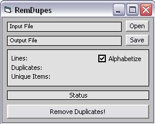



## A fast method to Remove Duplicates from Word Lists

### Description

Remove duplicate items from word lists.
 
### More Info
 
''''''''''''''''''''''''''''''''''''''''''''''''''''''''''''''''''''

'Removes duplicates from large (milllions) wordlists quickly

'

'Sorts wordlists using the quicksort algorithm, then

'removes duplicates in a single pass, O(n), by comparing

'each item against the preceding item.

'

'Items can be "unsorted" back to the order of the original

'wordlist with the use of an array of indexes, a new

'array containing the original position of each item.

'

'Stable Quicksort algorithms by Rde.

'http://www.pscode.com/vb/scripts/ShowCode.asp?txtCodeId=63941&amp;lngWId=1

'

'Much(!) faster Split replacement, "Quick Split," by Merri @ VBForums.com.

''''''''''''''''''''''''''''''''''''''''''''''''''''''''''''''''''''

'Note: memory usage issues

             |
---                |---
**Submitted On**   |2009-08-27 23:31:22
**By**             |[Richard V\.](https://github.com/Planet-Source-Code/PSCIndex/blob/master/ByAuthor/richard-v.md)
**Level**          |Beginner
**User Rating**    |5.0 (10 globes from 2 users)
**Compatibility**  |VB 6\.0
**Category**       |[String Manipulation](https://github.com/Planet-Source-Code/PSCIndex/blob/master/ByCategory/string-manipulation__1-5.md)
**World**          |[Visual Basic](https://github.com/Planet-Source-Code/PSCIndex/blob/master/ByWorld/visual-basic.md)
**Archive File**   |[A\_fast\_met2161158282009\.zip](https://github.com/Planet-Source-Code/richard-v-a-fast-method-to-remove-duplicates-from-word-lists__1-72408/archive/master.zip)

